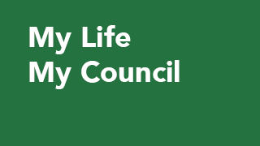

# MLMC

Is my council spending my money on the things I care about? How does my council's spending compare with other councils?

To find out the answers is difficult and time consuming. We need to dig through complex council reports such as annual reports, long-term plans etc. and have some level of prior knowledge to understand the meaning of the information in those reports.

Our team is using local government data (collected by Statistics NZ) to produce a web-based tool that will allow people see how much their council is spending on the services they feel are most interested in, and compare this with other councils.

The tool will also be able to produce a report for councils about which services are most important to users within their district.

It will foster people's curiosity about what happens with their money. The knowledge will also give people the power to influence their council to make decisions that will make their community a great place to live.
